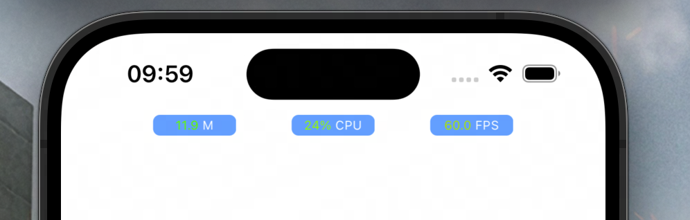

# APMHUD
APMHUD（Application Performance Monitor）实时监控应用的运行性能指标，包括内存占用、CPU占比、屏幕刷新率，以HUD的形式显示在屏幕上方，帮助开发者及时发现性能问题。

# 效果


#  安装
以`pod`方式接入，在Podfile文件中加上如下内容：

```
pod 'APMHUD', '~> 1.0.0'
```
然后执行`pod install`命令。

在项目中引入库：

```
import APMHUD
```
在应用启动完成后（**应用RootViewController初始化完成后**），开始进行性能监控。AppDelegate.swift文件中的`didFinishLaunchingWithOptions`方法中添加如下代码：

```
#if DEBUG

// 开启全部性能指标的监控
APMTool.shared.startMointors(types: [.Memory, .CPU, .FPS])  

#endif
```
如果停止性能监控，则可以调用如下方法：

```
// 只停止对内存和CPU的监控
APMTool.shared.stopMointors(types: [.Memory, .CPU]) 
```
显示和隐藏悬浮HUD：

```
// 指定需要显示的标签类型
APMTool.shared.showPMLabel(types: [.Memory, .CPU, .FPS])
```
```
// 隐藏所有的标签
APMTool.shared.hidePMLabel()
```


